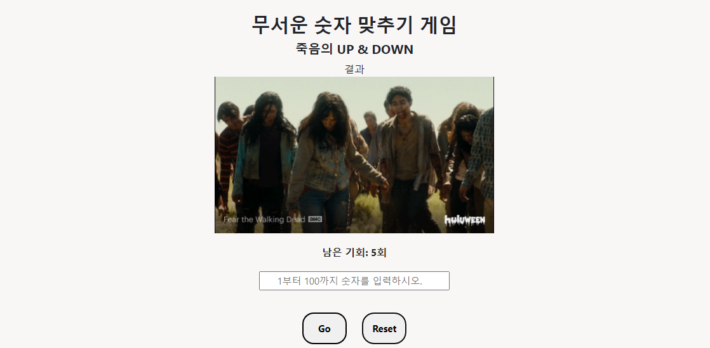

# 숫자 맞추기 게임

## 기능
+ 컴퓨터가 게임을 시작하면 자동으로 Random 숫자를 뽑는다.
+ 유저는 숫자를 입력하고 'Go'버튼을 클릭한다.
+ 유저가 입력한 숫자가 컴퓨터가 뽑은 숫자보다 작으면 'Up' 이라고 알려준다.
+ 유저가 입력한 숫자가 컴퓨터가 뽑은 숫자보다 크면 'Down' 이라고 알려준다.
+ 유저가 입력한 숫자와 컴퓨터가 뽑은 숫자가 일치하면 '정답 입니다.'라고 알려준다.
+ 정답을 맞추면 'Go'버튼은 비활성화 된다.
+ 유저는 총 5번의 기회가 있다
+ 5번의 기회가 초과되면 게임은 종료된다.
+ 게임이 종료되면 버튼은 비활성화된다.
+ 리셋버튼을 누르면 게임이 초기화된다.
+ 유저가 1~100범위 밖에 숫자를 입력하면 경고알림이 뜬다. (단, 기회는 줄어들지 않는다.)
+ 유저가 이미 입력한 값을 또 입력하면 경고알림이 뜬다. (단, 기회는 줄어들지 않는다.)
+ 반응형 UI

## 사용한 기술
+ HTML
+ CSS
+ Vanila Javascript
